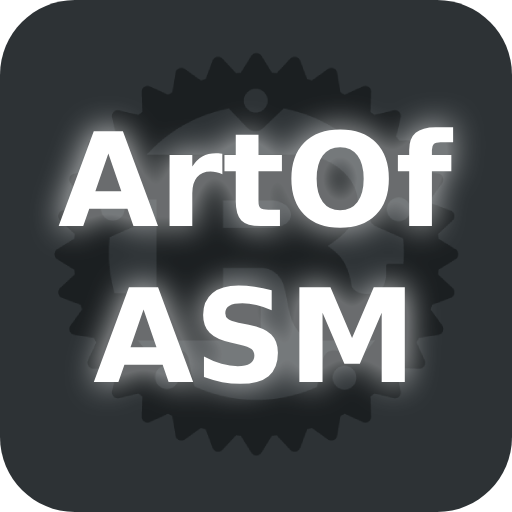

    
    

    <strong>ArtOfVM</strong>
    
A virtual machine written in Rust that hosts the best Assembly ever, ArtOfASM.

    

    
    
    
    

# ArtOfVM
A virtual machine written in Rust with the goal of hosting my own Assembly architecture: ArtOfAssembly, or ArtOfASM in short.

### How do I use it?
Download the executable targeted towards your platform (Windows x86_64-msvc and Linux x86_64-gnu are the only supported platforms) under [the latest release](https://github.com/artofcoding212/ArtOfVM/releases). You can use it with the following arguments:
* assemble [asm_file] [out_file]
    * Assembles the `[asm_file]` and writes the output to the `[out_file]`.
* dbg [out_file]
    * Prints out the machine code that the `[out_file]` represents.
* benchmark [out_file]
    * Executes the `[out_file]` 1,000 times and prints out the fastest & slowest times recorded as well as the median and average time in microseconds.
* exe [out_file]
    * Executes the `[out_file]`.

You can also download the repository and use the library in your Rust projects.

### How does it work?
**Virtual Machine (VM)**\
The VM follows the below steps, which in theory sound quite simple, however it's a lot more complex to implement:
* Decode the current instruction into a format that's easier to execute (see `Instruction` enum under src/vm.rs)
* Execute the decoded instruction
    * If the instruction is the halt instruction, break the loop
* Increment the instruction pointer by 1
* Repeat

**Assembler**\
The assembler for ArtOfASM, like the VM, also follows a set of steps until it reaches a certain point, which they are:
* If the current character is at an end-of-file (ASCII 0b00000000)...
    * Replace all of the bits and labels that are to be replaced with the corresponding label's bit position
    * Break the loop
* If the current character is a '.'...
    * Advance past the '.' and the label name
    * Store the label name in a `HashMap` as well as the bit position of the first instruction within the label
    * Skip the following steps and start from the top
* Otherwise, read the current operation code (opcode)
    * If it's invalid, throw an exception
* Assemble the current instruction based on the opcode
* If the instruction requests to assemble a label...
    * Increment the bit as if it pushed something to the machine code output
    * Store the current bit and the label it wants to access in a `Vec`
* Repeat